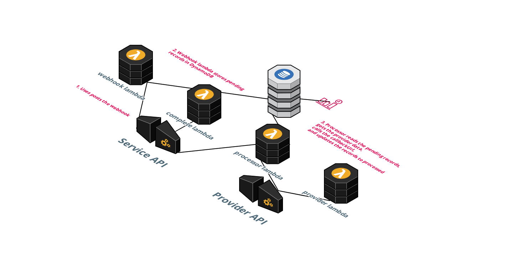
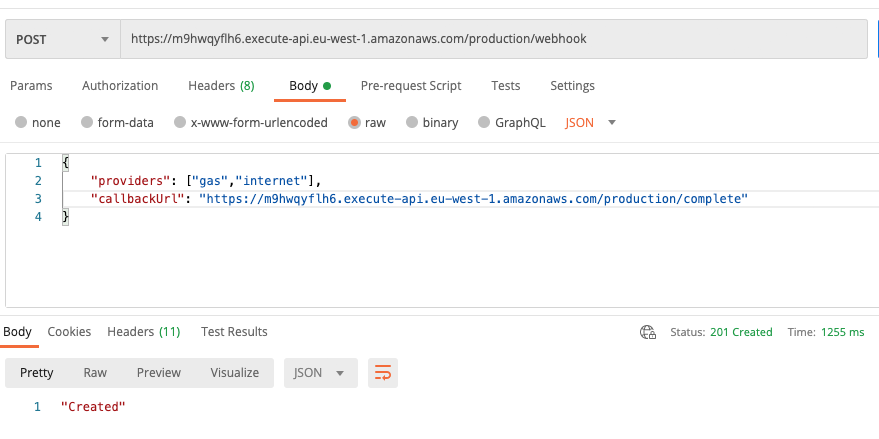
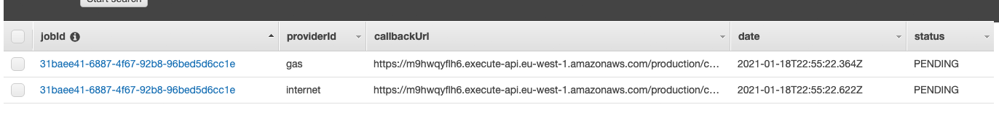
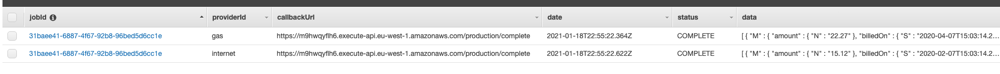

# Webhook Example

## Introduction

The following serverless web application processes 3rd-party APIs with the use of webhooks. As many 3rd-party services experience various issues including maintenance, temporary load issues etc, the process is asynchronous and will call back to the provided callbackUrl once it has recieved the data for the given job.

## Architecture

The serverless architecture is made up of two API Gateways, one for the service which contains the webhook, and one for the mock providers API.

Calling the webhook stores the async request into DynamoDB as a 'pending' record(s).

A processing lambda runs on a CloudWatch event to read any 'pending' records from DynamoDB and processes them. The lambda calls the provider service for the data, ensures it can successfully call the callbackUrl with the collected data (_mock complete endpoint provided for testing_), and updates the records to have a status of 'complete'.

Any failed records will be picked up on the next run of the processing lambda.



**Note**: This is a contrived example to demonstrate the basic use of serverless technologies with a Lerna monorepo and shared packages (both JS and TypeScript). Security and architecture best practices have not been taken into account for the light demo.

## Setup

### Install

1. clone the repo and install from the root

```
    npm i
```

2. bootstrap lerna from the root

```
    lerna bootstrap
```

### Deploy Production

1. cd into the providers folder

```
   cd ../providers
```

2. deploy providers service

```
   npm run deploy:prod
```

> copy the top endpoint url
>
> e.g. https://6u9zyr5fob.execute-api.eu-west-1.amazonaws.com/production

3. go to service/serverless.yml

   paste in the SERVICE_ENDPOINT property above e.g. https://6u9zyr5fob.execute-api.eu-west-1.amazonaws.com/production/providers

4. deploy services

```
   cd ../service
   npm run deploy:prod
```

> copy the two endpoint url e.g.
>
> https://4779c49ep8.execute-api.eu-west-1.amazonaws.com/production/complete
>
> https://4779c49ep8.execute-api.eu-west-1.amazonaws.com/production/webhook

5. Populate the provided postman collections using the generated endpoints (_postman/webhook production.postman_collection.json_)

## Running the webhook

1. Once setup (_above_) call the webhook endpoint using Postman



2. The relevant jobs will be populated in the DynamoDB table with the same Job ID (aggregated)



3. The lambda will run periodically to process the records in the database (_The callback URL will be notified of the data event_)



## Deploy Local

AWS LocalStack has been configured for testing locally using the steps above once the docker image is running using the following command in the service folder:

```
npm run start
```

Use npm run deploy:local instead of npm run deploy:prod

### Todo

- [x] Configure CloudWatch event
- [x] Add custom error
- [x] Add logging package
- [ ] Add lambda handler for correct status codes
- [ ] Add auth headers
- [ ] Add swaggers for the APIs
